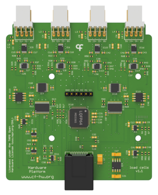

## Load Cells Reader

The Harp Load Cells Reader is the analog front end of the LoadCells. It excites, amplifies, and digitizes up to four load cells and streams their samples to the LoadCells interface board over a single RJ45 cable. Refer to the [connections](../connections.md?tabs=loadcellsreader#connections) article to set up the Reader and the [Acquire Data](../acquire-data.md) article to read its channels in Bonsai.

{width=350}

### Key Features

- 4 load cell inputs, each with its own instrumentation amplifier.
- 16-bit, simultaneous sampling of all 4 channels at 1 kHz.
- Per-channel offset compensation, set from the LoadCells over the same cable.
- Detected automatically by the LoadCells when plugged in or unplugged.

### Specs

- Load cell connectors: 4 × 4-pin (Molex KK, 2.54 mm pitch), labelled **5V**, **I+**, **I-**, and **0V** for excitation and differential signal
- Interface: 1 × RJ45 to the LoadCells, carrying the SPI bus, 5 V, and ground. Use a standard straight-through Ethernet patch cable. The link is not Ethernet, so never plug it into a network switch
- Excitation: 5 V, supplied by the LoadCells
- Analog-to-digital converter: 16-bit, 4-channel simultaneous sampling
- Header: 6-pin unpopulated header labelled **GND**, **A4**, **A3**, **A2**, **A1**, **V+**

> [!WARNING]
> **TODO**: Confirm the purpose of the 6-pin **A1**–**A4** header (it appears to expose the amplified analog signals), the input range and gain of the front end, and which load cell sensors have been validated with the Reader.

### Hardware

| Version | Compatible LoadCells | Notes |
| ------- | -------------------- | ----- |
| 1.1 | ≥ 1.0 | <ul><li> Current version in the repository (`harp load cells v1.1`), released with the LoadCells interface as `pcb1.1`. </li></ul> |

Assembled units are available from the [Open Ephys store](https://open-ephys.org/harp), or build your own using the hardware design files in the [LoadCells](https://github.com/harp-tech/device.loadcells) repository, which holds the Reader design under `Hardware/PCB` next to the interface board.

> [!WARNING]
> **TODO**: Confirm store availability for the Load Cells Reader.

[!INCLUDE ]
